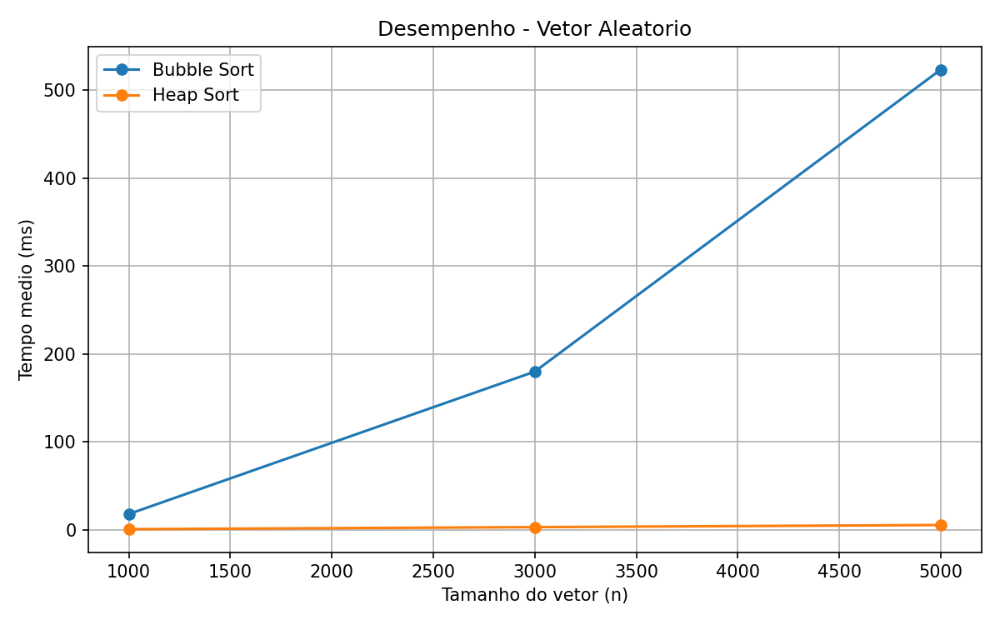
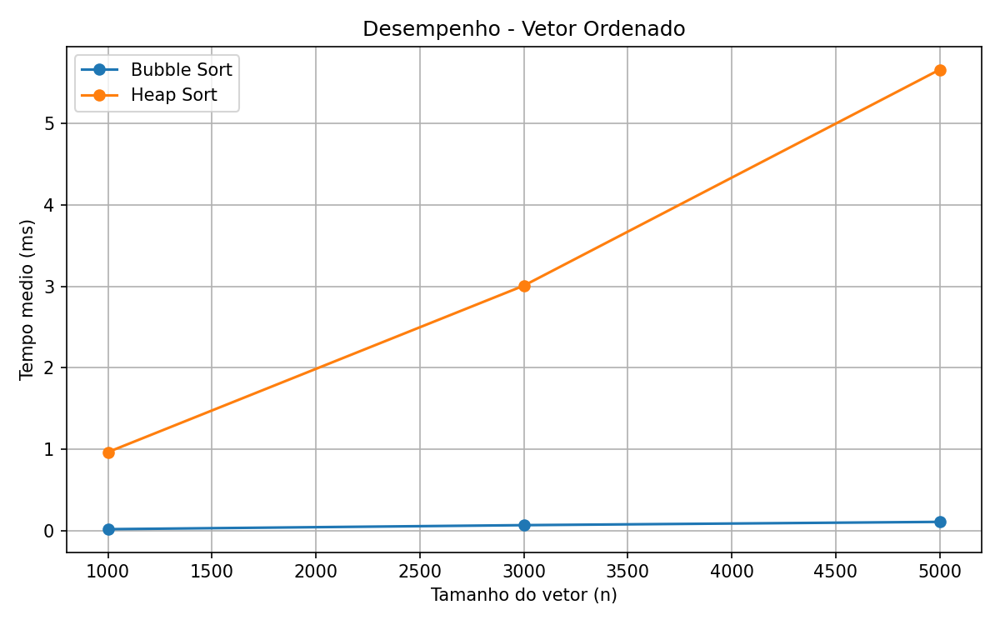

# Análise Experimental de Bubble Sort e Heap Sort

## Introdução

Algoritmos de ordenação organizam os elementos de uma coleção segundo uma relação de ordem. Eles são importantes porque aparecem como etapa auxiliar em buscas, processamento de dados, bancos de dados e diversas aplicações que dependem de dados estruturados.

Este trabalho compara experimentalmente dois algoritmos de ordenação com complexidades diferentes: Bubble Sort, de comportamento quadrático, e Heap Sort, de comportamento `O(n log n)`. A comparação foi feita em vetores ordenados, inversamente ordenados e aleatórios.

## Objetivos

Os objetivos do experimento são:

- avaliar o desempenho comparativo entre Bubble Sort e Heap Sort;
- observar como cada algoritmo se comporta em diferentes tipos de entrada;
- verificar se os tempos medidos acompanham a análise teórica de complexidade;
- registrar os resultados por meio de tabelas e gráficos.

## Algoritmos Utilizados

### Bubble Sort

O Bubble Sort percorre o vetor comparando pares de elementos adjacentes. Quando dois elementos estão fora de ordem, eles são trocados. Ao final de cada passagem, o maior elemento ainda não posicionado fica em sua posição correta no final do vetor.

A implementação usada possui uma otimização: se uma passagem completa não realiza nenhuma troca, o algoritmo encerra, pois o vetor já está ordenado.

Complexidade:

- Melhor caso: `O(n)`, quando o vetor já está ordenado e nenhuma troca ocorre na primeira passagem.
- Pior caso: `O(n^2)`, quando o vetor está em ordem inversa.
- Caso médio: `O(n^2)`, para entradas aleatórias.

Corretude:

Após a primeira passagem, o maior elemento do vetor está na última posição. Após a segunda passagem, o segundo maior elemento está na penúltima posição, e assim sucessivamente. O invariante do laço externo é: após `i` passagens, os `i` maiores elementos estão nas `i` últimas posições, em ordem correta. Quando o laço termina, todos os elementos estão posicionados corretamente. Se não ocorre troca em uma passagem, todos os pares adjacentes já estão em ordem, logo o vetor inteiro está ordenado.

### Heap Sort

O Heap Sort transforma o vetor em um heap máximo, isto é, uma estrutura em que cada nó pai é maior ou igual aos seus filhos. Em seguida, o maior elemento, localizado na raiz, é trocado com o último elemento da parte não ordenada. O tamanho do heap é reduzido e a propriedade de heap é restaurada com `heapify`.

Complexidade:

- Construção do heap: `O(n)`.
- Extrações sucessivas: `n - 1` extrações, cada uma com custo `O(log n)`.
- Melhor caso, pior caso e caso médio: `O(n log n)`.

Corretude:

Depois da construção inicial, a raiz contém o maior elemento do heap. A cada iteração, esse maior elemento é colocado no fim da parte ainda não ordenada. O invariante do laço de extração é: a parte final do vetor contém os maiores elementos já removidos, em ordem correta, e a parte inicial mantém a propriedade de heap. Ao final, todos os elementos foram removidos do heap e colocados em ordem crescente no vetor.

## Metodologia

Os testes foram executados em Python, usando:

- `random` para gerar vetores aleatórios;
- `time.perf_counter()` para medir o tempo de execução;
- `matplotlib` para gerar os gráficos;
- `unittest` para validar a corretude dos algoritmos.

Foram usados os tamanhos `1000`, `3000` e `5000`. Para cada tamanho foram avaliados três tipos de entrada:

- vetor aleatório;
- vetor já ordenado;
- vetor inversamente ordenado.

Foram realizadas 5 execuções para cada combinação de algoritmo, tamanho e tipo de entrada. Embora o enunciado cite 10 execuções como exemplo, 5 execuções foram adotadas para reduzir o tempo total do experimento, mantendo repetição suficiente para calcular uma média simples. A métrica analisada foi o tempo médio de execução em milissegundos.

O código também valida cada ordenação comparando o resultado produzido pelo algoritmo com `sorted(vetor_original)`.

## Resultados

| Tipo de vetor | Tamanho | Bubble Sort (ms) | Heap Sort (ms) |
|---|---:|---:|---:|
| Aleatório | 1000 | 18.031 | 0.761 |
| Aleatório | 3000 | 179.938 | 3.071 |
| Aleatório | 5000 | 523.332 | 5.465 |
| Inverso | 1000 | 22.956 | 0.815 |
| Inverso | 3000 | 223.288 | 2.831 |
| Inverso | 5000 | 637.869 | 4.876 |
| Ordenado | 1000 | 0.023 | 0.968 |
| Ordenado | 3000 | 0.072 | 3.009 |
| Ordenado | 5000 | 0.112 | 5.657 |

## Análise dos Resultados

Nos vetores aleatórios, o Bubble Sort cresceu rapidamente conforme o tamanho do vetor aumentou. Para `n = 5000`, seu tempo médio foi de `523.332 ms`, enquanto o Heap Sort ficou em `5.465 ms`. Esse comportamento está de acordo com a diferença teórica entre `O(n^2)` e `O(n log n)`.

Nos vetores inversamente ordenados, o Bubble Sort apresentou seu pior comportamento, pois precisa realizar muitas trocas. O tempo médio em `n = 5000` foi de `637.869 ms`, o maior valor observado no experimento. O Heap Sort permaneceu baixo, com `4.876 ms`, pois sua estrutura de heap mantém a complexidade `O(n log n)`.

Nos vetores ordenados, o Bubble Sort foi o mais rápido. Isso ocorreu por causa da otimização que interrompe a execução quando nenhuma troca acontece. Nesse caso, o algoritmo faz apenas uma passagem, resultando em comportamento `O(n)`. Para `n = 5000`, o Bubble Sort levou `0.112 ms`, contra `5.657 ms` do Heap Sort.

Assim, o Heap Sort teve melhor desempenho nos casos aleatório e inverso, enquanto o Bubble Sort foi melhor no caso já ordenado devido à otimização implementada.

## Conclusão

O experimento confirmou a análise teórica dos algoritmos. O Bubble Sort é simples, mas seu crescimento quadrático torna seu uso inadequado para entradas maiores quando os dados não estão ordenados. O Heap Sort foi mais eficiente nos cenários aleatório e inverso, mostrando a vantagem prática de um algoritmo `O(n log n)`.

A principal exceção ocorreu no vetor já ordenado, em que o Bubble Sort otimizado superou o Heap Sort por encerrar após a primeira passagem. Como limitação, o experimento mediu apenas tempo de execução, sem contar comparações ou trocas. Ainda assim, os resultados foram suficientes para comparar o comportamento dos algoritmos nos cenários exigidos.
